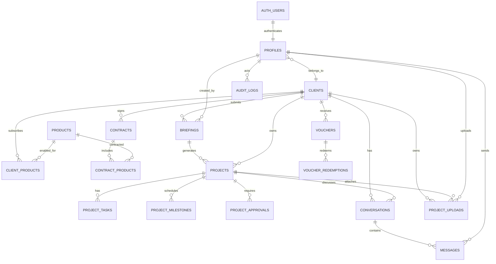

# DOZEDEV Studio - Modelo De Dados Proposto

Data: 2026-07-18

## Objetivo

Documentar o modelo de dados alvo para o DOZEDEV Studio como plataforma central do ecossistema DOZEDEV. Este documento descreve tabelas, alteracoes propostas, relacionamentos, chaves estrangeiras, fontes oficiais e estrategia de compatibilidade.

Nenhuma migration foi criada ou aplicada nesta fase.

## Diagrama De Relacionamentos



## Tabelas Existentes A Confirmar

Estas tabelas sao usadas pelo frontend atual, mas nem todas aparecem nas migrations locais.

- `auth.users`
- `public.profiles`
- `public.clients`
- `public.briefings`
- `public.vouchers`
- `public.project_comments`
- `public.notifications`
- `public.project_uploads`
- Storage bucket `project-files`

## Tabelas Novas Propostas

### `public.products`

Fonte oficial dos produtos DOZEDEV.

Campos propostos:

- `id uuid primary key`
- `code text unique not null`
- `name text not null`
- `slug text unique not null`
- `status text not null`
- `description text`
- `created_at timestamptz`
- `updated_at timestamptz`

Produtos iniciais:

- DOZEDEV Studio
- DOZECLIN
- DOZEMEC
- DOZEIRON
- DOZEEAT
- DOZEPLAY
- DOZETV

### `public.client_contacts` - Adiada

Nao criar agora. Enquanto existir apenas um contacto principal por cliente, usar diretamente:

- `clients.contact_name`
- `clients.email`
- `clients.phone`
- `clients.whatsapp`

Criar `client_contacts` somente quando houver necessidade real de multiplos contactos por empresa.

### `public.client_products`

Produtos habilitados ou contratados por cliente.

Campos:

- `id uuid primary key`
- `client_id uuid not null references public.clients(id)`
- `product_id uuid not null references public.products(id)`
- `status text not null`
- `started_at timestamptz`
- `ended_at timestamptz`
- `metadata jsonb default '{}'`
- `created_at timestamptz`
- `updated_at timestamptz`

Constraint:

- unique `(client_id, product_id)`.

### `public.contracts`

Contratos comerciais.

Campos:

- `id uuid primary key`
- `client_id uuid not null references public.clients(id)`
- `number text unique`
- `status text not null`
- `starts_on date`
- `ends_on date`
- `signed_at timestamptz`
- `metadata jsonb default '{}'`
- `created_at timestamptz`
- `updated_at timestamptz`

### `public.contract_products`

Produtos incluidos em contrato.

Campos:

- `id uuid primary key`
- `contract_id uuid not null references public.contracts(id)`
- `product_id uuid not null references public.products(id)`
- `status text not null`
- `price numeric(12,2)`
- `currency text default 'EUR'`
- `billing_cycle text`
- `created_at timestamptz`
- `updated_at timestamptz`

### `public.projects`

Entidade oficial de projeto.

Campos:

- `id uuid primary key`
- `client_id uuid not null references public.clients(id)`
- `briefing_id uuid references public.briefings(id)`
- `product_id uuid references public.products(id)`
- `name text not null`
- `description text`
- `service_type text`
- `status text not null`
- `priority text`
- `start_date date`
- `due_date date`
- `completed_at timestamptz`
- `progress integer default 0`
- `budget numeric(12,2)`
- `currency text default 'EUR'`
- `owner_profile_id uuid references public.profiles(id)`
- `created_by_profile_id uuid references public.profiles(id)`
- `created_at timestamptz`
- `updated_at timestamptz`

### `public.project_tasks`

Tarefas de projeto.

Campos:

- `id uuid primary key`
- `project_id uuid not null references public.projects(id)`
- `title text not null`
- `description text`
- `status text not null`
- `assignee_profile_id uuid references public.profiles(id)`
- `due_date date`
- `position integer`
- `created_at timestamptz`
- `updated_at timestamptz`

### `public.project_milestones`

Cronograma e marcos.

Campos:

- `id uuid primary key`
- `project_id uuid not null references public.projects(id)`
- `name text not null`
- `description text`
- `status text not null`
- `due_date date`
- `completed_at timestamptz`
- `created_at timestamptz`
- `updated_at timestamptz`

### `public.project_approvals`

Aprovacoes do cliente ou admin.

Campos:

- `id uuid primary key`
- `project_id uuid not null references public.projects(id)`
- `requested_by_profile_id uuid references public.profiles(id)`
- `approved_by_profile_id uuid references public.profiles(id)`
- `title text not null`
- `status text not null`
- `requested_at timestamptz`
- `approved_at timestamptz`
- `notes text`

### `public.conversations`

Agrupador de mensagens.

Campos:

- `id uuid primary key`
- `client_id uuid not null references public.clients(id)`
- `project_id uuid references public.projects(id)`
- `briefing_id uuid references public.briefings(id)`
- `type text not null`
- `status text not null`
- `created_at timestamptz`
- `updated_at timestamptz`

### `public.messages`

Mensagens oficiais.

Campos:

- `id uuid primary key`
- `conversation_id uuid not null references public.conversations(id)`
- `client_id uuid not null references public.clients(id)`
- `project_id uuid references public.projects(id)`
- `sender_profile_id uuid not null references public.profiles(id)`
- `receiver_profile_id uuid references public.profiles(id)`
- `body text not null`
- `status text not null default 'sent'`
- `created_at timestamptz`
- `read_at timestamptz`

### `public.voucher_redemptions`

Historico de utilizacao.

Campos:

- `id uuid primary key`
- `voucher_id uuid not null references public.vouchers(id)`
- `client_id uuid references public.clients(id)`
- `profile_id uuid references public.profiles(id)`
- `briefing_id uuid references public.briefings(id)`
- `project_id uuid references public.projects(id)`
- `redeemed_at timestamptz`
- `metadata jsonb default '{}'`

### `public.voucher_events` - Opcional

Historico especifico de voucher para eventos de dominio.

Nao criar inicialmente. Usar `public.audit_logs` como fonte oficial. Criar `voucher_events` apenas se a UI precisar de uma timeline amigavel do voucher separada da auditoria tecnica.

Campos:

- `id uuid primary key`
- `voucher_id uuid not null references public.vouchers(id)`
- `actor_profile_id uuid references public.profiles(id)`
- `event_type text not null`
- `message text`
- `metadata jsonb default '{}'`
- `created_at timestamptz`

Observacao: `voucher_events` nao substitui `audit_logs`; registra timeline de dominio do voucher. `audit_logs` segue sendo a auditoria global.

### `public.audit_logs`

Auditoria unificada.

Campos:

- `id uuid primary key`
- `occurred_at timestamptz not null`
- `actor_user_id uuid references auth.users(id)`
- `actor_profile_id uuid references public.profiles(id)`
- `client_id uuid references public.clients(id)`
- `module text not null`
- `entity_type text not null`
- `entity_id uuid`
- `action text not null`
- `severity text not null default 'info'`
- `summary text`
- `old_data jsonb`
- `new_data jsonb`
- `metadata jsonb default '{}'`
- `ip inet`
- `user_agent text`

## Alteracoes Em Tabelas Existentes

### `public.profiles`

Confirmar estrutura real antes.

Campos esperados/adicionados:

- `id uuid primary key` ligado ao Auth UID.
- `client_id uuid references public.clients(id)`.
- `nome text` ou `name text`, padronizar mantendo compatibilidade.
- `email text`.
- `role text`.
- `status text default 'active'`.
- `created_at timestamptz`.
- `updated_at timestamptz`.

### `public.clients`

Fonte oficial de cliente.

Campos esperados/adicionados:

- `id uuid primary key`
- `type text`
- `name text not null`
- `legal_name text`
- `document text`
- `email text`
- `phone text`
- `whatsapp text`
- `country text`
- `city text`
- `address text`
- `contact_name text`
- `status text`
- `origin text`
- `created_at timestamptz`
- `updated_at timestamptz`

Vinculo oficial:

- `profiles.client_id -> clients.id`. Nao adicionar `clients.profile_id`, para evitar circularidade desnecessaria.

### `public.briefings`

Manter dados atuais e adicionar relacoes.

Campos a adicionar:

- `client_id uuid references public.clients(id)`.
- `profile_id uuid references public.profiles(id)`.
- `product_id uuid references public.products(id)`.
- `status text`.
- `archived_at timestamptz`.

Nao adicionar:

- `converted_project_id`. O relacionamento oficial deve existir apenas em `projects.briefing_id`, evitando FK circular.

Campos legados preservados:

- `nome`
- `email`
- `empresa`
- `telefone`
- `tipo_projeto`
- `voucher_codigo`

### `public.vouchers`

Evoluir sem quebrar `ativo`.

Campos a adicionar:

- `client_id uuid references public.clients(id)`.
- `product_id uuid references public.products(id)`.
- `created_by_profile_id uuid references public.profiles(id)`.
- `benefit text`.
- `description text`.
- `status text`.
- `public_token text unique`.
- `max_uses integer`.
- `used_count integer`.
- `valid_from timestamptz`.
- `valid_until timestamptz`.
- `cancelled_at timestamptz`.
- `cancelled_by_profile_id uuid references public.profiles(id)`.
- `metadata jsonb default '{}'`.

Compatibilidade:

- `ativo` permanece durante transicao.
- `limite_uso` pode alimentar `max_uses`.
- `usos` pode alimentar `used_count`.
- `validade` pode alimentar `valid_until`.

### `public.project_uploads`

Campos a adicionar:

- `client_id uuid references public.clients(id)`.
- `project_id uuid references public.projects(id)`.
- `briefing_id uuid references public.briefings(id)`.
- `uploaded_by_profile_id uuid references public.profiles(id)`.
- `storage_bucket text default 'project-files'`.
- `storage_path text`.
- `original_filename text`.
- `mime_type text`.
- `size_bytes bigint`.
- `status text default 'active'`.

Compatibilidade:

- `user_id`, `email`, `nome_arquivo`, `caminho`, `tipo` preservados ate migracao completa.

### `public.project_comments`

Tabela legada.

Plano:

- manter leitura temporaria;
- migrar para `conversations` + `messages`;
- congelar novas escritas quando frontend migrar.

## RLS Planejada

## Sprint 3.1.1 - Decisoes Aplicadas Na Fundacao

A migration preparada da Sprint 3.1 usa uma versao inicial e minima de `audit_logs`, com:

- `id uuid primary key`
- `occurred_at timestamptz not null`
- `actor_profile_id uuid references public.profiles(id) on delete set null`
- `client_id uuid references public.clients(id) on delete set null`
- `entity_type text not null`
- `entity_id uuid`
- `action text not null`
- `old_data jsonb`
- `new_data jsonb`
- `ip inet`
- `user_agent text`
- `metadata jsonb not null default '{}'::jsonb`

Seguranca aplicada na fundacao:

- `audit_logs` com RLS habilitada desde a criacao.
- Apenas `select` para `authenticated`, filtrado por `is_studio_admin()`.
- Nenhum `grant insert`, `update` ou `delete` direto para `authenticated`.
- Escrita prevista somente por RPC/Edge Function com `service_role` ou fluxo administrativo controlado.
- Campos sensiveis como senha, token, service role e segredo Turnstile nao devem ser gravados.

Protecao de `profiles` na fundacao:

- `profiles.client_id` permanece nullable para compatibilidade e admins sem cliente.
- FK `profiles.client_id -> clients.id` usa `on delete set null`.
- Varios perfis podem apontar para o mesmo cliente.
- `id`, `role`, `client_id` e `created_at` sao protegidos por trigger contra update direto do cliente.
- Backfill revisado usa `set_config('app.allow_profile_protected_update', 'on', true)` dentro da transacao para permitir associacao controlada.

Concorrencia:

- A RPC `create_studio_client_profile(...)` usa advisory lock transacional por email normalizado.
- Indices unicos normalizados continuam pendentes ate diagnostico real de duplicados.

### Helpers

Funcoes sugeridas:

- `public.current_profile_id()`
- `public.current_client_id()`
- `public.is_studio_admin()`
- `public.can_access_client(client_id uuid)`
- `public.can_access_project(project_id uuid)`

### Politicas Por Entidade

- `profiles`: `id = auth.uid()` para proprio perfil; admin le todos.
- `clients`: cliente acessa se `id = current_client_id()`; admin acessa todos.
- `briefings`: cliente acessa por `client_id`; admin acessa todos.
- `projects`: cliente acessa por `client_id`; admin acessa todos.
- `conversations`: cliente acessa por `client_id`; admin/suporte acessa por permissao.
- `messages`: acesso pela conversa permitida.
- `vouchers`: admin gere; cliente ve vinculados; validacao publica via funcao/RPC segura.
- `project_uploads`: cliente acessa por `client_id`; admin acessa todos.
- `audit_logs`: apenas admin/sistema.

## Indices Planejados

- `profiles(client_id)`
- `profiles(email)`
- `clients(email)`
- `briefings(client_id)`
- `briefings(profile_id)`
- `briefings(created_at)`
- `projects(client_id)`
- `projects(client_id, status)`
- `projects(briefing_id)`
- `messages(project_id)`
- `messages(conversation_id, created_at)`
- `messages(sender_profile_id)`
- `conversations(client_id)`
- `conversations(project_id)`
- `project_uploads(client_id)`
- `project_uploads(project_id)`
- `vouchers(public_token)`
- `vouchers(client_id)`
- `audit_logs(entity_type, entity_id)`
- `audit_logs(client_id, occurred_at)`

## Compatibilidade E Descontinuacao

### Compatibilidade Temporaria

- Campos de email continuam para exibicao e backfill.
- `project_comments` continua legivel.
- `vouchers.ativo`, `usos`, `limite_uso`, `validade` continuam durante transicao.
- `briefings` continua como fonte visual enquanto `projects` e criado.

### Descontinuado Apos Migracao

- Relacionar por email.
- Deduzir clientes a partir de briefings.
- Tratar briefing como projeto.
- Apagar briefing fisicamente.
- Usar `project_comments` para chat principal.
- Validar voucher expondo IDs internos.

## Consultas De Diagnostico Necessarias

Rodar no Supabase antes de qualquer migration:

```sql
select table_schema, table_name
from information_schema.tables
where table_schema = 'public'
order by table_name;

select column_name, data_type, is_nullable
from information_schema.columns
where table_schema = 'public'
  and table_name in (
    'profiles',
    'clients',
    'briefings',
    'vouchers',
    'project_comments',
    'notifications',
    'project_uploads'
  )
order by table_name, ordinal_position;

select schemaname, tablename, policyname, cmd, qual, with_check
from pg_policies
where schemaname = 'public'
order by tablename, policyname;
```

## Confirmacoes

- Este documento nao e uma migration.
- Nenhum SQL foi aplicado.
- O modelo precisa de validacao contra o Supabase real antes da implementacao.
