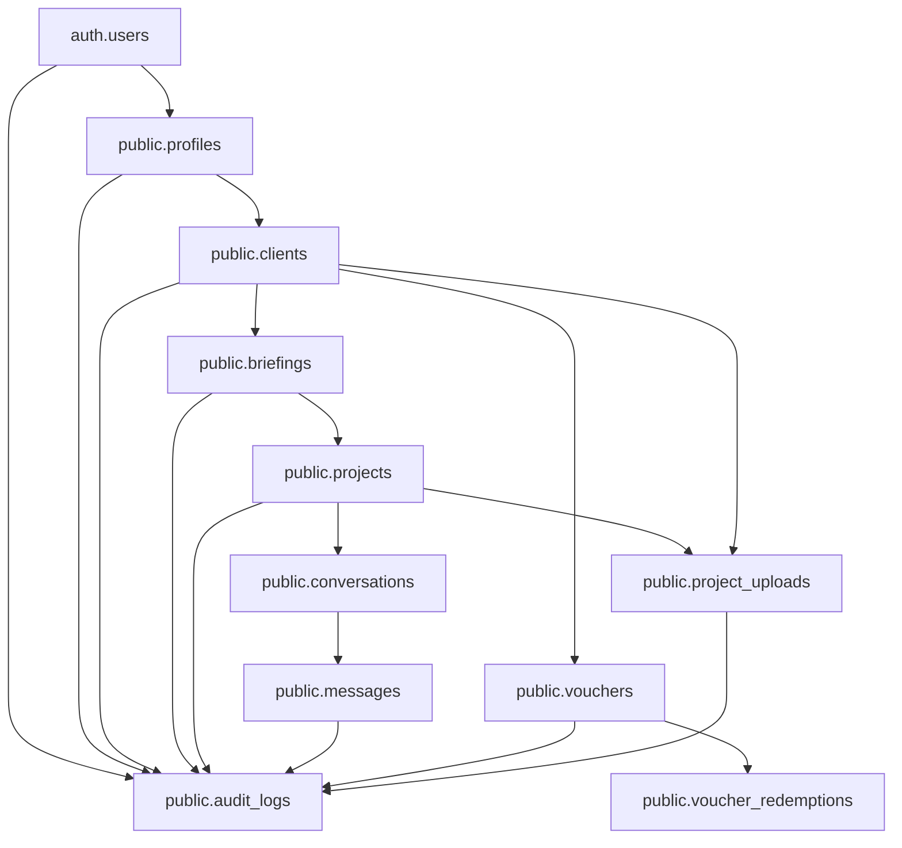
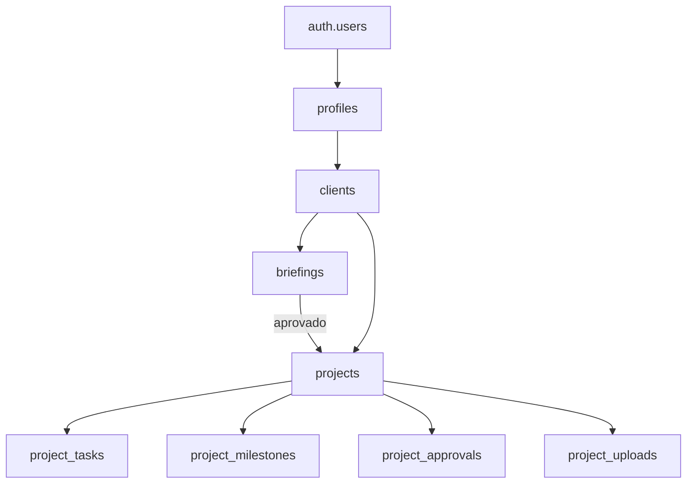
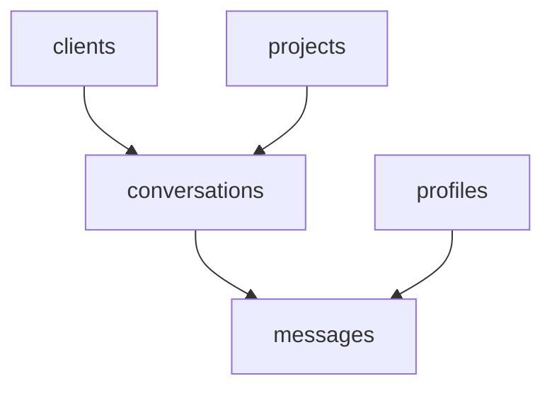

# DOZEDEV Studio - Fase 2 - Plano Tecnico

Data: 2026-07-18

## Objetivo

Definir a arquitetura tecnica de implantacao do DOZEDEV Studio como nucleo operacional do ecossistema DOZEDEV, corrigindo os problemas diagnosticados na Fase 1 sem implementar ainda as alteracoes.

Esta fase e exclusivamente documental. Nao inclui codigo funcional, migrations, SQL aplicado, deploy, commit ou push.

## Principios Aprovados

- O DOZEDEV Studio sera o nucleo central do ecossistema DOZEDEV.
- A arquitetura deve suportar produtos atuais e futuros: DOZECLIN, DOZEMEC, DOZEIRON, DOZEEAT, DOZEPLAY, DOZETV e outros.
- A organizacao deve ser orientada a dominios de negocio, nao a paginas do frontend.
- Email e atributo de contacto, nao chave de relacionamento.
- A cadeia de identidade deve partir de `auth.users.id`.
- `public.clients` sera a fonte oficial de clientes.
- Briefing e projeto sao entidades diferentes.
- Mensagens devem sobreviver ao ciclo de vida do briefing.
- Vouchers precisam de QR, card, compartilhamento, historico, cancelamento e auditoria.
- Auditoria deve ser unificada para todos os modulos.
- Toda transicao deve preservar compatibilidade e evitar perda de informacao.

## Arquitetura Por Dominios

### Clientes

Responsavel por identidade operacional do cliente no Studio.

Inclui:

- cadastro;
- perfis;
- empresas;
- contatos;
- contratos;
- produtos contratados;
- relacao com Supabase Auth.

Fonte oficial:

- `auth.users`: identidade de autenticacao.
- `public.profiles`: perfil de acesso.
- `public.clients`: entidade comercial/operacional do cliente.
- `public.client_products`: produtos DOZEDEV contratados ou habilitados.

Adiado:

- `public.client_contacts`: nao criar agora. Enquanto houver apenas um contacto principal, usar `clients.contact_name`, `clients.email`, `clients.phone` e `clients.whatsapp`.

### Projetos

Responsavel pelo ciclo de vida da entrega.

Inclui:

- briefings;
- projetos;
- tarefas;
- cronograma;
- arquivos;
- aprovacoes;
- status operacional.

Fonte oficial:

- `public.briefings`: solicitacoes e diagnosticos iniciais.
- `public.projects`: projetos ativos/reais.
- `public.project_tasks`: tarefas futuras.
- `public.project_milestones`: cronograma futuro.
- `public.project_approvals`: aprovacoes futuras.
- `public.project_uploads`: metadados de arquivos.

### Comunicacao

Responsavel por conversas, notificacoes e historico comunicacional.

Inclui:

- mensagens;
- notificacoes;
- comentarios;
- historico de leitura;
- conversas por projeto.

Fonte oficial:

- `public.conversations`: conversa por cliente/projeto/contexto.
- `public.messages`: mensagens normalizadas.
- `public.notifications`: notificacoes operacionais.

Compatibilidade:

- `public.project_comments` deve ser tratado como legado/transicao.

### Financeiro

Responsavel por vouchers, orcamentos, faturas e pagamentos.

Inclui:

- vouchers;
- beneficios;
- validade;
- utilizacao;
- cancelamento;
- orcamentos;
- faturas;
- pagamentos;
- cobrancas.

Fonte oficial inicial:

- `public.vouchers`;
- `public.voucher_redemptions`;
- `public.audit_logs`.

Opcional:

- `public.voucher_events`: criar apenas se for necessario exibir uma timeline amigavel especifica do voucher. A auditoria oficial continua sendo `public.audit_logs`.

Futuro:

- `public.quotes`;
- `public.invoices`;
- `public.payments`;
- `public.billing_events`.

### Plataforma

Responsavel por produtos, permissoes, auditoria e integracoes.

Inclui:

- produtos DOZEDEV;
- permissoes;
- contratos;
- auditoria unificada;
- configuracoes;
- integracoes.

Fonte oficial:

- `public.products`;
- `public.audit_logs`;
- `public.contracts`;
- `public.contract_products`;
- `public.admin_profiles` para administracao do site principal.

Observacao: estruturas ja existentes do DOZECLIN nos schemas `dozeclin` e `dozedev` nao devem ser alteradas por esta implantacao.

## Diagrama Geral



## Fontes Oficiais De Dados

| Entidade | Fonte oficial | Fontes legadas/transicao | Observacao |
|---|---|---|---|
| Autenticacao | `auth.users` | nenhuma | Gerida pelo Supabase Auth |
| Perfil de acesso | `public.profiles` | nenhuma | Um perfil por Auth UID |
| Cliente | `public.clients` | `briefings.email` | `briefings` nao representa cliente |
| Produto DOZEDEV | `public.products` | `systems` da area global | Avaliar fusao/compatibilidade |
| Briefing | `public.briefings` | atual `briefings` | Deve ganhar `client_id` e `profile_id` |
| Projeto | `public.projects` | briefings com status de projeto | Nova entidade oficial |
| Mensagens | `public.messages` | `project_comments` | Comentarios viram legado/transicao |
| Conversas | `public.conversations` | nenhuma | Agrupa mensagens por contexto |
| Vouchers | `public.vouchers` | atual `vouchers` | Evoluir estrutura sem perder dados |
| Uploads | `public.project_uploads` | atual `project_uploads` | Deve ganhar relacoes fortes |
| Auditoria | `public.audit_logs` | logs pontuais/futuros | Unificada |

## Fluxo Transacional De Cadastro

Nao deve ser feito apenas no frontend.

### Opcao Recomendada

Edge Function `register-studio-client`, usando service role somente no servidor.

Responsabilidades:

1. Validar entrada: nome, email, senha, empresa e contacto.
2. Normalizar email.
3. Verificar duplicidade em `auth.users`, `profiles` e `clients`.
4. Criar utilizador em Supabase Auth.
5. Criar `public.profiles`.
6. Criar ou associar `public.clients`.
7. Preencher `clients.contact_name`, `clients.email`, `clients.phone` e `clients.whatsapp`, quando informados.
8. Criar evento em `public.audit_logs`.
9. Se qualquer etapa falhar, compensar a criacao do Auth ou abortar antes de criar registros dependentes.

### Alternativa

RPC transacional `public.register_studio_client(...)`.

Limitacao: RPC nao cria `auth.users` com seguranca usando anon key. Seria adequada apenas se o Auth continuar sendo criado antes por `signUp`, mas isso nao elimina totalmente orfaos em caso de falha posterior.

### Decisao Tecnica

Preferir Edge Function para criar Auth + dados publicos numa operacao controlada de backend.

## Estrutura De Clientes, Briefings E Projetos



### Regras

- Um `profile` pertence a um Auth UID.
- Um `profile` cliente aponta para um `client`.
- Um `client` pode ter varios `briefings`.
- Um `briefing` pode nao gerar projeto.
- Um `briefing` pode gerar um ou mais `projects` futuramente.
- Um `project` pertence obrigatoriamente a um `client`.
- Um `project` pode referenciar o `briefing` de origem.
- Manter somente `projects.briefing_id`. Nao criar `briefings.converted_project_id`, para evitar FK circular.

## Arquitetura De Mensagens

Modelo recomendado:



### Regras

- `conversations` define contexto: cliente, projeto, briefing ou suporte.
- `messages` armazena conteudo, remetente, destinatario opcional, status e leitura.
- `project_comments` deve ser mantida como legado ate migracao.
- A UI pode continuar mostrando "Comentarios do Projeto", mas a fonte oficial futura sera `messages`.

## Arquitetura Completa De Vouchers

### Componentes

- `vouchers`: dados principais.
- `voucher_redemptions`: utilizacoes.
- `audit_logs`: auditoria global da acao.
- `voucher_events`: opcional, apenas para timeline visual do voucher, se necessario.
- Pagina publica `/studio/voucher.html?code=...` ou equivalente.
- Geracao local de `voucher-qr.svg` e `voucher-card.svg`.

### Funcionalidades

- Criar voucher com codigo unico e entropia adequada.
- Vincular cliente opcionalmente.
- Definir produto/servico/beneficio.
- Definir validade, limite de uso e status.
- Editar campos controlados.
- Cancelar/revogar sem apagar historico.
- Copiar codigo.
- Copiar link publico.
- Enviar por WhatsApp sem numero fixo.
- Enviar por email com assunto e corpo.
- Gerar QR Code.
- Gerar card visual 1200 x 1200.
- Validar publico sem expor IDs internos.

### Status Sugeridos

- `draft`;
- `active`;
- `used`;
- `expired`;
- `cancelled`;
- `revoked`.

## Uploads E Arquivos

### Regras

- Bucket oficial: `project-files`, se confirmado no Supabase.
- Path recomendado: `clients/{client_id}/projects/{project_id}/{upload_id}/{safe_filename}`.
- Metadados em `project_uploads`.
- Validar tipo, tamanho e nome.
- Gerar signed URLs curtas.
- Cliente le apenas arquivos do proprio `client_id`.
- Admin le arquivos conforme permissao.

### Campos essenciais

- `client_id`;
- `project_id`;
- `briefing_id`;
- `uploaded_by_profile_id`;
- `storage_bucket`;
- `storage_path`;
- `original_filename`;
- `mime_type`;
- `size_bytes`;
- `status`;
- `created_at`;

## Auditoria Unificada

Tabela unica: `public.audit_logs`.

Eventos auditaveis:

- cadastro;
- login administrativo relevante, quando aplicavel;
- criacao/edicao/cancelamento de cliente;
- criacao/aprovacao/rejeicao de briefing;
- criacao/alteracao de projeto;
- envio/leitura de mensagem;
- upload/download/cancelamento de arquivo;
- criacao/edicao/cancelamento/utilizacao de voucher;
- alteracao de permissao;
- mudancas de contrato/produto.

Principio: cada modulo emite eventos para a mesma estrutura, com `actor_profile_id`, `entity_type`, `entity_id`, `action`, `old_data`, `new_data`, `ip` e `user_agent`. Assim o suporte consegue saber quem fez, em qual entidade, quando, o que mudou antes e depois.

## RLS E Permissoes Planejadas

### Perfis

- Admin global: pode ler todos os dados do Studio.
- Cliente: pode ler apenas dados ligados ao seu `client_id`.
- Suporte/comercial/financeiro futuros: permissao por modulo.

### Politicas

- `profiles`: cliente le o proprio perfil; admin le todos.
- `clients`: cliente le apenas seu cliente; admin le todos.
- `briefings`: cliente le/cria seus briefings; admin le todos.
- `projects`: cliente le seus projetos; admin gere todos.
- `messages`: participantes da conversa leem; remetente cria; admin/suporte responde.
- `vouchers`: admin gere; cliente le vouchers vinculados ou valida por codigo publico controlado.
- `project_uploads`: cliente le/cria seus arquivos; admin le todos.
- `audit_logs`: admin le; cliente nao le por padrao.

## Estrategia De Migracao Dos Dados Atuais

### Diagnostico Inicial

- Auth sem profile.
- Profiles sem client.
- Clients duplicados por email.
- Briefings sem profile/client.
- Uploads sem client/project/briefing.
- Comentarios sem briefing valido.
- Vouchers sem status/beneficio/cliente.

### Transicao

1. Criar novas colunas nullable primeiro.
2. Backfill por email apenas como transicao controlada.
3. Validar duplicidades.
4. Criar constraints depois do backfill.
5. Atualizar frontend para ler novas relacoes.
6. Manter campos antigos por compatibilidade.
7. Descontinuar leituras por email apos validacao.

### Rollback Obrigatorio Por Migration

Toda migration futura deve conter uma secao documentada de rollback com passos explicitos:

1. Como desativar a funcionalidade nova no frontend por feature flag.
2. Como voltar as leituras para a estrutura antiga.
3. Como reverter ou neutralizar dados criados pela migration, sem apagar informacao historica sem backup.

Nao basta declarar que a migration e reversivel; cada sprint deve documentar o procedimento operacional de rollback.

## Compatibilidade

Permanece compativel:

- Login atual via Supabase Auth.
- Paginas `studio/login.html`, `dashboard.html`, `briefing.html`, `admin.html`.
- Tabelas atuais enquanto durarem as migrations de transicao.
- `project_comments` durante migracao para `messages`.
- `vouchers.ativo` durante transicao para `status`.

Sera descontinuado:

- Cliente derivado de `briefings.email`.
- Projetos representados apenas por `briefings.status`.
- Mensagens acopladas somente a briefing.
- Relacionamentos por email como regra operacional.
- Delete fisico de briefing/voucher usado.

## Riscos

- Dados antigos podem conter emails duplicados.
- Algumas tabelas usadas pelo frontend nao aparecem nas migrations locais.
- RLS real pode divergir do repositorio.
- Storage pode ter policies manuais nao versionadas.
- Criar entidade `projects` exige adaptacao gradual da UI.
- Migracao por email pode associar registros errados se houver duplicidade.

Mitigacao:

- Rodar diagnosticos antes de qualquer migration.
- Fazer backfill em etapas.
- Manter campos antigos ate validacao completa.
- Criar relatorios de divergencia.
- Testar com dois clientes reais distintos.

## Feature Flags

Durante a migracao, funcionalidades novas devem ser ativadas por modulo. Proposta de configuracao:

```js
const FEATURES = {
  projectsV2: false,
  messagesV2: false,
  uploadsV2: false,
  vouchersV2: false,
  auditLogsV2: false
};
```

Regras:

- Feature flag desativada mantem leitura/escrita no fluxo legado.
- Feature flag ativada direciona apenas o modulo correspondente para o fluxo novo.
- Rollback funcional deve poder ser feito desativando a flag antes de qualquer reversao de dados.

## Views E Consultas

Nao criar views em excesso. Usar views apenas quando:

- varios dashboards reutilizam a mesma consulta;
- a consulta possui muitos joins;
- houver ganho real de desempenho ou simplificacao.

Caso contrario, preferir selects relacionais do cliente Supabase.

Views candidatas, somente se a complexidade justificar:

- `admin_clients_overview`;
- `admin_projects_overview`;
- `studio_client_dashboard`;
- `voucher_public_validation`.

## Indices Planejados

- `profiles(client_id)`;
- `profiles(email)`;
- `clients(email)`;
- `briefings(client_id)`;
- `briefings(profile_id)`;
- `briefings(created_at)`;
- `projects(client_id)`;
- `projects(client_id, status)`;
- `projects(briefing_id)`;
- `messages(project_id)`;
- `messages(conversation_id, created_at)`;
- `messages(sender_profile_id)`;
- `conversations(client_id)`;
- `conversations(project_id)`;
- `project_uploads(client_id)`;
- `project_uploads(project_id)`;
- `vouchers(public_token)`;
- `vouchers(client_id)`;
- `audit_logs(entity_type, entity_id)`;
- `audit_logs(client_id, occurred_at)`;

## Ordem Recomendada De Implantacao

1. Auditoria SQL real e inventario do Supabase.
2. Cadastro, `profiles`, `clients` e auditoria base.
3. Projetos e briefings.
4. Mensagens.
5. Uploads e Storage.
6. Vouchers.
7. Dashboards, otimizacoes e limpeza do legado.

## Divisao Em Sprints Menores

### Sprint 3.1 - Cadastro, Perfis, Clientes E Auditoria Base

- Auditoria SQL real.
- Edge Function `register-studio-client`.
- Backfill profiles/clients.
- `audit_logs`.
- `products`.
- Feature flags iniciais.

Rollback:

1. Desativar `auditLogsV2` e leituras novas.
2. Voltar cadastro para fluxo legado temporariamente.
3. Manter colunas/tabelas novas sem apagar dados ate validacao.

### Sprint 3.2 - Projetos E Briefings

- `projects`.
- Criar projeto via admin.
- Conversao briefing -> projeto com `projects.briefing_id`.
- Projetos visiveis para cliente correto.

Rollback:

1. Desativar `projectsV2`.
2. Voltar dashboards para briefings legados.
3. Preservar projetos criados para reativacao posterior.

### Sprint 3.3 - Mensagens

- `conversations`.
- `messages`.
- Migracao de `project_comments`.
- Leitura/status/realtime.

Rollback:

1. Desativar `messagesV2`.
2. Voltar UI para `project_comments`.
3. Manter mensagens novas preservadas.

### Sprint 3.4 - Uploads E Storage

- Paths seguros.
- Policies.
- Vinculos com cliente/projeto/briefing.
- Visualizacao/download seguros.

Rollback:

1. Desativar `uploadsV2`.
2. Manter leitura por metadados legados.
3. Nao mover/apagar ficheiros sem manifest de migracao.

### Sprint 3.5 - Vouchers

- Modelo completo.
- Edicao/cancelamento.
- Compartilhamento.
- QR/card.
- Validacao publica.

Rollback:

1. Desativar `vouchersV2`.
2. Voltar a usar campos `ativo`, `usos`, `limite_uso` e `validade`.
3. Preservar `voucher_redemptions` e tokens criados.

### Sprint 3.6 - Dashboards, Otimizacoes E Limpeza Do Legado

- Dashboards por dominios.
- Indices finais.
- Views apenas quando justificadas.
- Remocao gradual de leituras por email.
- `DOZEDEV_STUDIO_ERROR`.
- Revisao responsiva.
- Checklist completo.

Rollback:

1. Manter flags antigas disponiveis durante periodo de observacao.
2. Restaurar consultas legadas se indicadores falharem.
3. Remover legado apenas apos backup e validacao.

## Arquivos Que Serao Alterados Em Fases Futuras

Frontend Studio:

- `studio/js/auth.js`
- `studio/js/dashboard.js`
- `studio/js/admin.js`
- `studio/js/briefing.js`
- `studio/js/comments.js`
- `studio/js/vouchers.js`
- `studio/js/uploads.js`
- `studio/js/realtime.js`
- `studio/js/notifications.js`
- `studio/js/main.js`
- `studio/login.html`
- `studio/dashboard.html`
- `studio/admin.html`
- `studio/briefing.html`
- futuro `studio/voucher.html`

Estilos:

- `studio/css/components.css`
- `studio/css/dashboard.css`
- `studio/css/forms.css`
- `studio/css/modals.css`
- `studio/css/responsive.css`

Banco e backend futuros, somente apos aprovacao:

- novas migrations em `supabase/migrations/`
- Edge Functions em `supabase/functions/`, se o projeto passar a versiona-las

Documentacao:

- `docs/DOZEDEV-STUDIO-AUDITORIA.md`
- `docs/DOZEDEV-STUDIO-DATABASE.md`
- `docs/DOZEDEV-STUDIO-ROADMAP.md`
- `docs/DOZEDEV-STUDIO-TESTES.md`

## Pontos A Confirmar Diretamente No Supabase

- Estrutura real de `public.profiles`.
- Estrutura real de `public.clients`.
- Estrutura real de `public.briefings`.
- Estrutura real de `public.vouchers`.
- Estrutura real de `public.project_comments`.
- Estrutura real de `public.notifications`.
- Estrutura real de `public.project_uploads`.
- Constraints e indices existentes.
- Triggers existentes.
- RLS e policies reais.
- Buckets Storage e policies.
- Registros orfaos.
- Duplicidade por email.
- Se existem Edge Functions ja publicadas.
- Se ha tabelas de contratos, pagamentos ou produtos fora das migrations locais.

## Confirmacoes Da Fase 2

- Nenhum codigo funcional deve ser alterado nesta fase.
- Nenhuma migration deve ser criada ou modificada nesta fase.
- Nenhum SQL deve ser aplicado.
- Nenhuma alteracao de banco deve ser executada.
- Nenhum deploy, commit ou push deve ser feito.
- Implementacao depende de aprovacao expressa.
