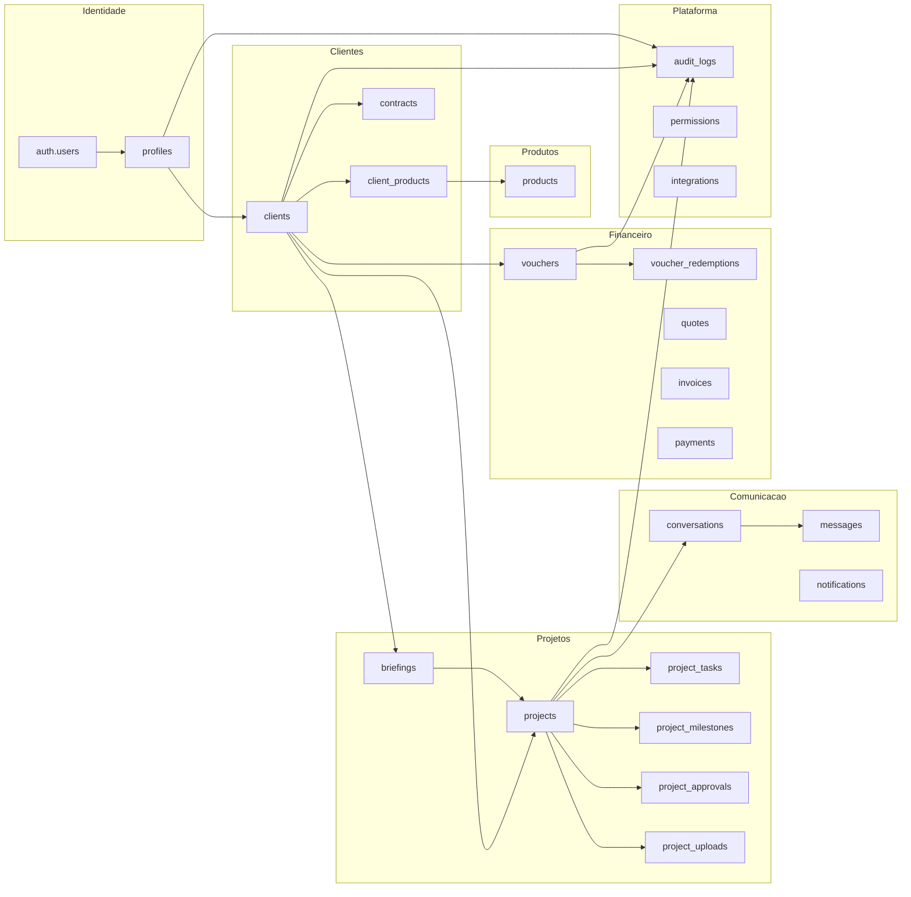

# DOZEDEV Studio - Roadmap Da Plataforma

Data: 2026-07-18

## Visao

O DOZEDEV Studio sera a plataforma central de relacionamento, operacao e gestao do ecossistema DOZEDEV. Ele deve servir tanto o site principal quanto os produtos atuais e futuros, mantendo dominios reutilizaveis e evitando duplicacao de entidades como clientes, projetos, mensagens, vouchers, uploads, contratos e auditoria.

## Arquitetura Final Proposta

## Modulos Existentes

### Parcialmente Implementados

- Autenticacao via Supabase Auth.
- `profiles` para perfil de acesso.
- Briefings.
- Admin Studio.
- Dashboard do cliente.
- Vouchers basicos.
- Comentarios por briefing.
- Uploads basicos.
- Realtime parcial.

### Implementados Com Problemas De Arquitetura

- Clientes derivados de briefings.
- Projetos derivados de briefings.
- Mensagens acopladas a briefing.
- Uploads sem relacao completa com cliente/projeto.
- Cadastro nao transacional.
- Logs e erros dispersos.

## Modulos Futuros

### Clientes

- Cadastro transacional.
- Empresas e contactos.
- Produtos contratados.
- Contratos.
- Historico do cliente.

### Projetos

- Conversao briefing -> projeto.
- Projetos com status proprio.
- Tarefas.
- Cronograma.
- Aprovacoes.
- Entregas.

### Comunicacao

- Conversas.
- Mensagens.
- Leitura e status.
- Notificacoes.
- Templates de comunicacao.

### Financeiro

- Vouchers completos.
- QR Code e card.
- Orcamentos.
- Faturas.
- Pagamentos.
- Cobrancas.

### Plataforma

- Produtos DOZEDEV.
- Permissoes por modulo.
- Auditoria unificada.
- Integracoes.
- Configuracoes globais.

## Dependencias Entre Modulos

| Modulo | Depende de | Motivo |
|---|---|---|
| Cadastro transacional | Auth, profiles, clients | Evitar orfaos |
| Clientes | profiles | Vincular identidade a entidade comercial |
| Briefings | clients, profiles | Saber quem solicitou |
| Projetos | clients, briefings, products | Separar solicitacao de execucao |
| Mensagens | profiles, clients, projects | Conversas por contexto |
| Uploads | clients, projects, profiles | Segurança e organizacao |
| Vouchers | clients, products, profiles | Beneficio e auditoria |
| Auditoria | profiles, clients | Registrar ator e entidade |
| Contratos | clients, products | Base comercial |
| Financeiro | clients, contracts, products | Cobranca futura |

## Ordem Ideal De Implementacao

1. Confirmar schema real no Supabase.
2. Cadastro, `profiles`, `clients` e auditoria base.
3. Projetos e briefings.
4. Mensagens.
5. Uploads e Storage.
6. Vouchers.
7. Dashboards, otimizacoes e limpeza do legado.
8. Contratos, produtos contratados e financeiro futuro.

## Modulos Reutilizaveis Por Todos Os Produtos DOZEDEV

- Identidade e perfis.
- Clientes.
- Produtos contratados.
- Projetos.
- Mensagens.
- Notificacoes.
- Uploads.
- Vouchers/promocoes.
- Contratos.
- Auditoria.
- Permissoes.
- Integracoes.

Produtos que podem reutilizar esses modulos:

- DOZECLIN;
- DOZEMEC;
- DOZEIRON;
- DOZEEAT;
- DOZEPLAY;
- DOZETV;
- futuros produtos DOZEDEV.

Observacao: a reutilizacao deve respeitar arquiteturas ja existentes dos produtos. Esta roadmap nao autoriza alteracao direta em schemas ou projetos especificos como DOZECLIN.

## Backlog Tecnico Da Plataforma

### Fundacao

- Inventario SQL real.
- Versionar migrations do Studio antigo.
- Criar helpers RLS.
- Criar auditoria unificada.
- Criar fonte oficial de produtos.

### Cadastro E Clientes

- Edge Function de cadastro.
- Reparar utilizadores orfaos.
- Criar client para profiles existentes.
- Normalizar emails.
- Impedir duplicidade.

### Projetos

- Criar `projects`.
- Backfill de projetos a partir de briefings elegiveis.
- Criar modal Novo Projeto.
- Criar timeline por projeto.
- Criar status padronizados.

### Comunicacao

- Criar conversations/messages.
- Migrar project_comments.
- Implementar read_at.
- Melhorar realtime.
- Padronizar envio e erro.

### Vouchers

- Status completo.
- Codigo unico robusto.
- Public token.
- Pagina publica de validacao.
- QR SVG.
- Card SVG/PNG.
- WhatsApp/email/copia.
- Historico de uso.

### Uploads

- Validar tipo/tamanho.
- Sanitizar nomes.
- Reorganizar paths.
- Vincular client/project/briefing.
- Revisar policies Storage.
- Testar isolamento entre clientes.

### Segurança

- RLS por UUID/client_id.
- Remover relacoes por email.
- Reduzir deletes fisicos.
- Revisar anon/authenticated.
- Testar usuarios comuns.

### UX E Operacao

- Corrigir encoding.
- Loading states.
- Empty states.
- Mensagens amigaveis.
- Logs `DOZEDEV_STUDIO_ERROR`.
- Responsividade.

## Roadmap Por Sprints

### Sprint 1 - Ja Concluida

- Auditoria tecnica inicial.
- Checklist manual de testes.
- Identificacao dos problemas estruturais.

### Sprint 2 - Plano Tecnico

- Arquitetura por dominios.
- Modelo de dados.
- Roadmap.
- Plano de migracao.

### Sprint 3.1 - Cadastro, Perfis, Clientes E Auditoria Base

- Cadastro transacional.
- Profiles.
- Clients.
- Auditoria base.
- Feature flags.
- Rollback documentado por migration.

### Sprint 3.2 - Projetos E Briefings

- Entidade `projects`.
- Briefing -> projeto.
- Novo Projeto.
- Area cliente com projetos reais.

### Sprint 3.3 - Mensagens

- Conversations/messages.
- Migracao project_comments.
- Notificacoes.
- Realtime revisado.

### Sprint 3.4 - Uploads E Seguranca

- Storage policies.
- Vinculos.
- Validacao.
- Testes RLS.

### Sprint 3.5 - Vouchers

- Modelo completo.
- QR/card.
- Compartilhamentos.
- Historico e cancelamento.

### Sprint 3.6 - Dashboards, Otimizacoes E Limpeza Do Legado

- Dashboards por dominios.
- Indices compostos.
- Views somente quando justificadas.
- Remocao gradual de leituras por email.

### Sprint 9 - Auditoria, UX E Hardening

- Logs.
- Auditoria em todos os fluxos.
- Revisao visual.
- Testes finais.

## Itens Descontinuados Planejados

- `briefings.email` como chave operacional.
- Clientes deduzidos de briefings.
- Projetos representados apenas por briefings.
- Chat baseado somente em `project_comments`.
- Voucher apenas booleano `ativo`.
- Uploads sem client/project.
- Deletes fisicos para entidades com historico.

## Marcos De Aceite

- Cadastro nao gera orfaos.
- Cliente existe em `public.clients`.
- Admin clientes usa fonte oficial.
- Cliente ve apenas seus dados.
- Projeto e entidade propria.
- Mensagens funcionam por projeto/conversa.
- Vouchers possuem QR, card, sharing e historico.
- Uploads sao seguros.
- Auditoria registra acoes relevantes.
- RLS validada com dois clientes.

## Restricoes Mantidas

- Nao alterar DOZECLIN nesta roadmap.
- Nao aplicar migrations sem aprovacao.
- Nao fazer deploy automatico.
- Nao fazer commit/push sem autorizacao.
